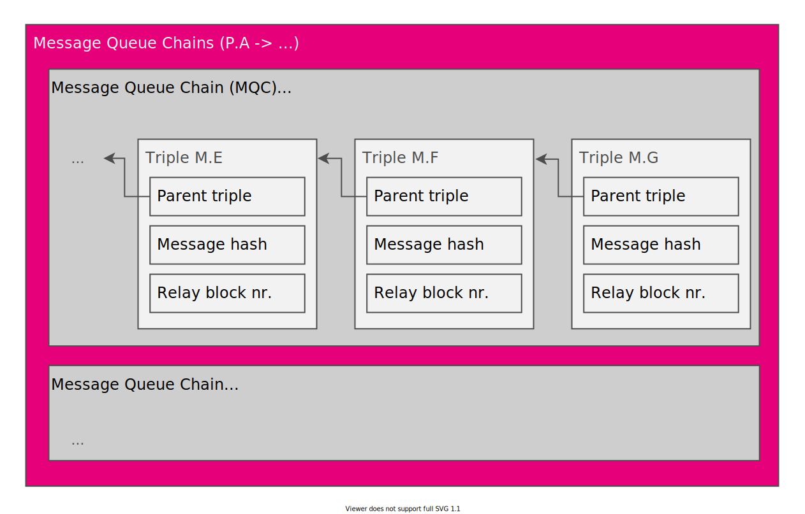

# Polkadot Message Passing

## Overview

Polkadot implements two types of message passing mechanisms; vertical passing
and horizontal passing.

* Vertical message passing refers to the communication between the parachains
  and the relay chain. More precisely, when the relay chain sends messages to a
  parachain, it's "downward message passing". When a parachain sends messages to
  the relay chain, it's "upward message passing".

* Horizontal message passing refers to the communication between the parachains,
  only requiring minimal involvement of the relay chain. The relay chain
  essentially only stores proofs that message where sent and whether the
  receiving parachain has read those messages.


Implementation wise, upward messages are inserted into candidate commitments,
which the validators send to the relay chain. Parachains can call into the
`downward_messagess` Runtime function in order to receive messages.

For horizontal passing, Polkadot currently implements the mechanism known as
Horizontal Relay-routed Message Passing (HRMP), which fully relies on vertical
message passing in order to communicate between parachains. Consequently, this
obviously goes against the entire idea of horizontal passing in the first place,
since now every message has to be inserted into the relay chain itself,
therefore heavily increasing footprint and resource requirements. However, the
upcoming replacement of HRMP is Cross-Chain Message Passing (XCMP), which, as
intended, exchanges messages directly between parachains and only updates proofs
and read-confirmations on chain. With XCMP, vertical message processing is only
used for opening and closing channels.

## HRMP

### Channels

A channel is a construct on the relay chain indicating an open, one-directional
communication line between a sending parachain and a receiving parachain,
including information about how the channel is being used. A channel construct
is created for each, individual communication line.

A channel contains the following fields:

`Channel`:

- `sender_deposit: int`: staked balances of sending parachain.
- `recipient_deposit: int`: staked balances of receiving parachain.
- `used_places: int`: number of messages used by the sending parachain in this
  channel.
- `used_bytes: int`: total number of bytes used by the sending parachain in this
  channel.
- `sealed: bool`:  indicator wether the channel is sealed. If it is, then the
  receiving parachain will no longer accept any new messages.

This structure is created or overwritten on every start of each session.
Individual fields of this construct are updated for every message sent, such as
`used_places` and `used_bytes`. If the channel is sealed and `used_places`
reaches `0` (occurs when a new session begins), this construct is be removed on
the *next* session start.

The Runtime maintains a structure of the current, open channels in a map. The
key is a tuple of the sender ParaId and the recipient ParaId, where the value is
the corresponding `Channel` structure.

```
channels: map(ParaId, ParaId) => Channel
```

### Opening Channels

Polkadot places a certain limit on the amount of channels that can be opened
between parachains. Only the the sending parachain can open a channel.

In order to open a channel, the sending parachain must send an opening request
to the relay chain. The request is a construct containing the following fields:

`ChOpenRequest`:

- `sender: int`: the ParaId of the sending parachain.
- `recipient: int`: the ParaId of the receiving parachain.
- `confirmed: bool`: indicated whether the recipient has accepted the channel.
  On request creation, this value is `false`.
- `age: int`: the age of this request, which start at `0` and is incremented by
  1 on every session start.

TODO: Shouldn't `ChOpenRequest` also have an `initiator` field? Or can only the
sender open an channel?

The Runtime appends those requests to an array, which the Runtime processes in
an ordered form (FIFO):

```
open_requests: [ChOpenRequest]
```

#### Workflow

The sending parachain calls into the `init_open_channel(recipient)` Runtime function.

Params:
- `recipient: int`: the ParaId of the receiving parachain the channel should be
  opened with.

The Runtime checks the following conditions in order for the function call to
succeed:

* The `sender` and the `recipient` exist.
* `sender` is not the `recipient`.
* There's currently not a active channel established, either seal or unsealed
  (TODO: what if there's an active closing request pending?).
* There's not already an open channel request for `sender` and `recipient`
  pending.
* The caller of this function (`sender`) has capacity for a new channel. An open
  request counts towards the capacity (TODO: where is this defined?).
* The caller of this function (`sender`) has enough funds to cover the deposit.

If one of those conditions is false, the function call returns with an error. On
success, the following steps are executed:

* Reserve a deposit for the caller of this function (`sender`) (TODO: how
  much?).
* Append the `ChOpenRequest` request to the pending request list (`open_requests`).

### Accepting Channels

TODO: How does a Parachain decide which channels should be accepted? Probably
off-chain consensus/agreement?

#### Workflow

The receiving parachain can except a channel by calling into the
`accept_open_channel(index)` Runtime function.

Params:

* `index: int`: the index of the open request list.

The Runtime check the following conditions in order for the function call to succeed:

* The `index` is valid (the value is within range of the list).
* The `recipient` ParaId corresponds to the ParaId of the caller of this
  function.
* The caller of this function (`recipient`) has enough funds to cover
  the deposit.

If one of those conditions is false, this function call returns with an error
(TODO: or panics). On success, the following steps are executed:

* Reserve a deposit for the caller of this function (`recipient`).
* Confirm the open channel request in the request list by setting the
  `confirmed` field to `true`.

### Closing Channels

A close channel request is a construct containing the following
fields:

`ChCloseRequest`:

- `initiator: int`: the ParaId of the parachain which initiated this request,
  either the sender or the receiver.
- `sender: int`: the ParaId of the sending parachain.
- `recipient: int`: the ParaId of the receiving parachain.

The Runtime appends those requests to an array, which the Runtime processes in
an ordered form (FIFO):

```
close_requests: [ChCloseRequest]
```

### Workflow

Both the sending and receiving parachain can close a channel by calling into the
`close_channel(sender, recipient)` Runtime function.

Params:

* `sender` - the ParaId of the sending parachain.
* `recipient` - the ParaId of the recipient parachain.

The Runtime function checks the following conditions in order for the function
call to succeed:

* There's currently and open channel or a pending open channel request between
  `sender` and `recipient`.
* The channel is not sealed.
* The caller of the Runtime function is either the `sender` or `recipient`.
* There is not existing close channel request.

If one of the following conditions is wrong, this function call returns with an
error. On success, the following steps are executed:

* Append the request `ChCloseRequest` to the request list (`close_requests`).

### Sending messages

The Runtime treats messages as SCALE encoded byte arrays and has no concept or
understanding of the message type or format itself. Consensus on message format
must be established between to communicating parachains.

Messages intended to be read by other Parachains are inserted into
`horizontal_messages` of the candidate commitments (`CandidateCommitments`),
while message which are only intended to be read by the relay chain are inserted
into `upward_messages`.

The messages are included by collators into the committed candidate receipt (),
which contains the following fields:

`CommittedCandidateReceipt`:

* `descriptor: CandidateDescriptor`: the descriptor of the candidate.
* `commitments: CandidateCommitments`: the commitments of the candidate receipt.

The candidate descriptor contains the following fields:

`CandidateDescriptor`:

* `para_id: ParaId`: the ID of the para this is a candidate for.
* `relay_parent: Hash`: the hash of the relay chain block this is executed in
  the context of.
* `collator: CollatorId`: the collator's SR25519 public key.
* `persisted_validation_data_hash: Hash`: the hash of the persisted valdation
  data. This is extra data derived from the relay chain state which may vary
  based on bitfields included before the candidate. Therefore, it cannot be
  derived entirely from the relay parent.
* `pov_hash: Hash`: the how of the PoV block.
* `signature: Signature`: the signature on the Blake2 256-bit hash of the
  following components of this receipt:
  * `para_id`
  * `relay_parent`
  * `persisted_validation_data_hash`
  * `pov_hash`

The candidate commitments contains the following fields:

`CandidateCommitments`:

* `fees: int`: fees paid from the chain to the relay chian validators
* `horizontal_message: []`: a SCALE encoded arrary containing the messages
  intended to be received by the recipient parachain.
* `upward_messages: []`: message destined to be interpreted by the relay chain
  itself.
* `erasure_root: Hash`: the root of a block's erasure encoding Merkle tree.
* `new_validation_code: Option<ValidationCode>`: new validation code for the
  parachain.
* `head_data: HeadData`: the head-data produced as a result of execution.
* `processed_downward_messages: u32`: the number of messages processed from the
  DMQ.
* `hrmp_watermark: BlockNumber`: the mark which specifies the block number up to
  which all inbound HRMP messages are processed.

## XCMP

XCMP is a mechanism of Polkadot which allows Parachains to communicate with each
other and to prove that messages have been sent. A core principle is that the
relay chain remains as thin as possible in regards to messaging and only
contains the required information for the validity of message processing.


The entire XCMP process requires a couple of steps:

* The sending parachain creates a local Message Queue Chain (MQC) of the
  messages it wants to send and inserts the Merkle root into a structure on the
  relay chain, known as the Channel State Table (CST).

* The messages are sent to the receiving parachain and contain the necessary
  data in order to reproduce the MQC.

* The BIOS module of the receiving parachain process those messages. The
  messages are then inserted into the next parablock body as inherent
  extrinsics.

* Once that parablock is inserted into the relay chain, the receiving parachain
  then updates the Watermark, which points to the relay block number which
  includes the parablock. This serves as an indicator that the receiving
  parachain has processed messages up to that relay block.

Availabilty

* The messages created by the sending parachain must be kept available for at
  least one day. When AnV assigns validators to check the validity of the
  sending parachains parablocks, it can load the data from the CST, which
  includes the information required in order to regenerate the MQC.

* ...

## MQC: Message Queue Chain

The Message Queue Chain (MQC) is a has hash chain construct which keeps track of
any messages sent from a sending parachain to an individual, receiving
parachain. Each block within the MQC is a triple containing the following
fields:

`Triple:`
- `parent_hash`: The hash of the previous triple.
- `message_hash`: The hash of the message itself.
- `number`: The relay block number at which the message was sent.



A MQC is always specific to one channel. Additional channels require its own,
individual MQC. The MQC is not saved on the relay chain, only the last triple of
the MQC is inserted into the CST. This way, all messages sent can be verified
while keeping the relay chain footprint minimal. The MQC also provides a clear
structure in which order the receiving parachain should process those messages.

The messages which get sent directly to the receiving parachain must append the
necessary proofs and metadata in order to regenerate and verify the MQC.

## CST: Channel State Table

The Channel State Table (CST) is a map construct on the relay chain which keeps
track of every MQC generated by a single sending parachain. The corresponding
value is a list of pairs, where each pair contains the ParaId of the receiving
parachain, the Merkle root of MQC heads and the relay block number where that
item was last updated in the CST. This provides a mechanism for receiving
parachains to easily verify messages sent from a specific source.

```
cst: map ParaId => [ChannelState]
```

`ChannelState`:

* `last_updated: BlockNumber`: the block number where the CST was last updated.
* `mqc_head: Hash | null`: The MQC head. This item is `null` in case there is no
  prior message.

The `mqc_head` is `null` iin case there is no prior message.

Besides the CST, there's also a CST Root, which is an additional map construct
and contains an entry for every sending parachain and the corresponding Merkle
root of each `ChannelState` in the CST.

```
cst_roots: map ParaId => Hash
```

When a PoV block on the receiving parachain is created, the collator which
builds that block fetches the pairs of the sending parachain from the CST and
creates its own Merkle root. When that PoV block is sent to the validator, the
validator can just fetch the Merkle root from the CST Root and verify the PoV
block without requiring the full list of pairs.

## Message content

All messages sent to the receiving parachain must contain enough information in
order for the receiving parachain to verify those messages with the CST. This
includes the necessary Merkle trie nodes, the parent triple of each individual
MQC block and the messages themselves. The receiving parachain then recreates
the MQC and verifies it against the CST.

## Watermark

Collators of the receiving parachain insert the messages into their parablock as
Inherents and publish the parablock to the relay chain. Once included, the
watermark is updated and points to the relay chain block number where the
inclusion ocurred.

```
watermark: map ParaId => (BlockNumber, ParaId)
```

## SPREE


